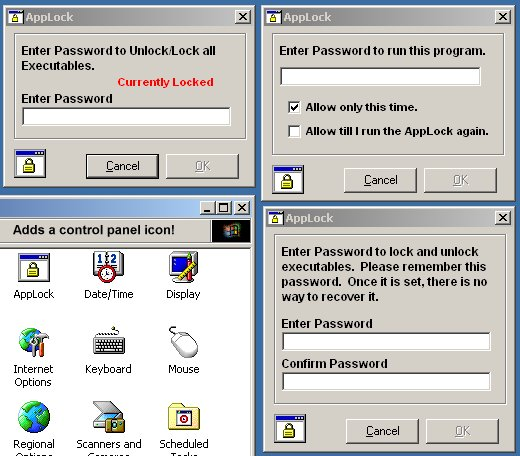



## AppLock\! an executable locker\.

### Description

This program, WHICH MUST BE COMPILED TO WORK, will allow you to lock and unlock the ability to run executable files on your system. It also creates a icon on the desktop that cannot be deleted as well as a control panel. Also includes NukeAppLock, to remove all the registry entries it creates.

Oh yea, if you can figure out a way around this, let me know.
 
### More Info
 

             |
---                |---
**Submitted On**   |2002-03-31 20:58:54
**By**             |[Johneboy](https://github.com/Planet-Source-Code/PSCIndex/blob/master/ByAuthor/johneboy.md)
**Level**          |Beginner
**User Rating**    |5.0 (40 globes from 8 users)
**Compatibility**  |VB 6\.0
**Category**       |[Complete Applications](https://github.com/Planet-Source-Code/PSCIndex/blob/master/ByCategory/complete-applications__1-27.md)
**World**          |[Visual Basic](https://github.com/Planet-Source-Code/PSCIndex/blob/master/ByWorld/visual-basic.md)
**Archive File**   |[AppLock\!\_a672443312002\.zip](https://github.com/Planet-Source-Code/johneboy-applock-an-executable-locker__1-33267/archive/master.zip)

